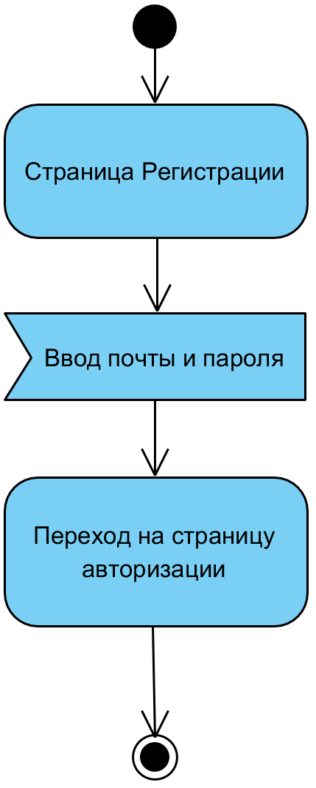
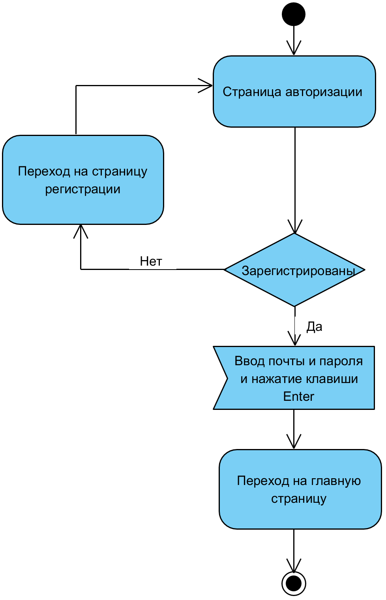
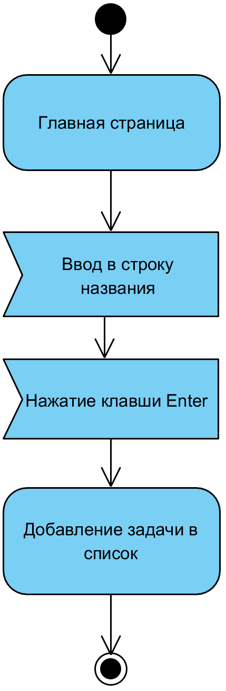
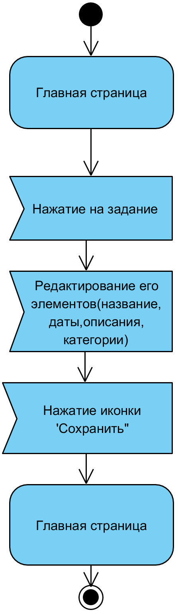
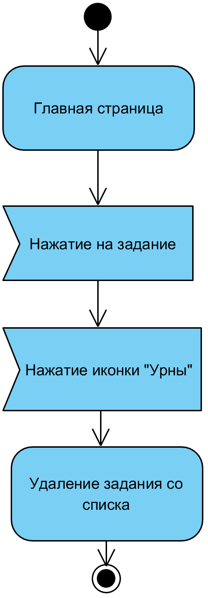

# Диаграммы Активности
---
# Содержание
1. [Регистрация](#1)
2. [Авторизация](#2)
3. [Добавление задачи](#3)
4. [Редактирование задачи](#4)
5. [Удаление задачи](#5)

### 1. Регистрация
После ввода логина и пароля и нажатии клавиши Sign Up мы попадаем на страницу авторизации.

### 2. Авторизация 
При нажатии на вкладку "Processes"/"Resources" происходит переход в выбранную вкладку.

### 3. Добавление задачи
При вводе названия задания в строку "Add Task" и нажатие клавиши Enter создается новая задача.

### 4. Редактирование задачи 
При нажатии на название задачи, появляется окно с параметрами задачи. После редактирования параметров, надимаем на иконку "Сохранить".

### 5. Удаление задачи
При нажатии на название задачи, появляется окно с параметрами задачи. После нажатия на иконку "Урны", задача удалится.

