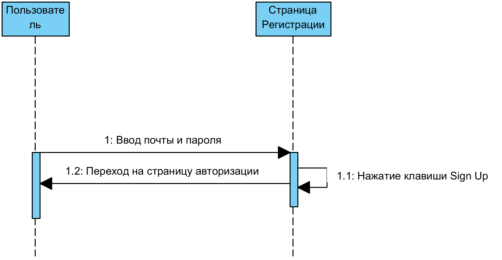
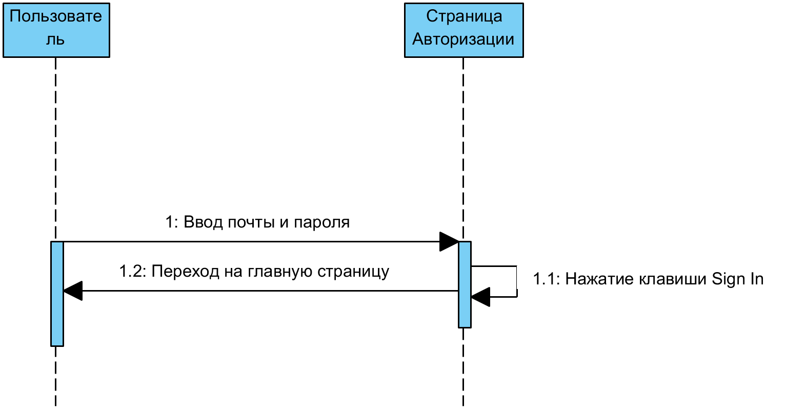
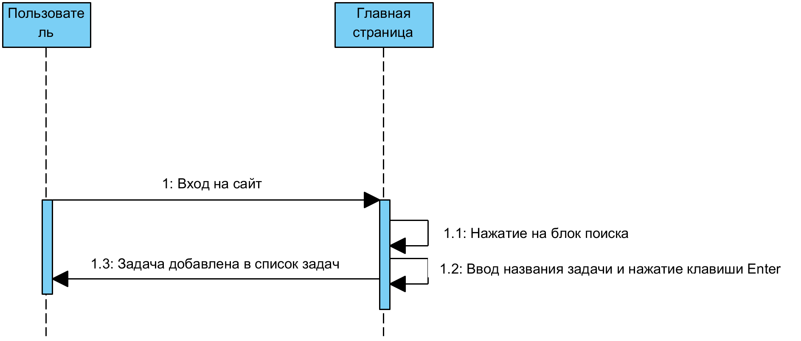
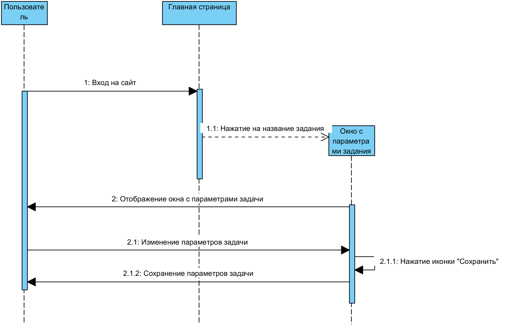
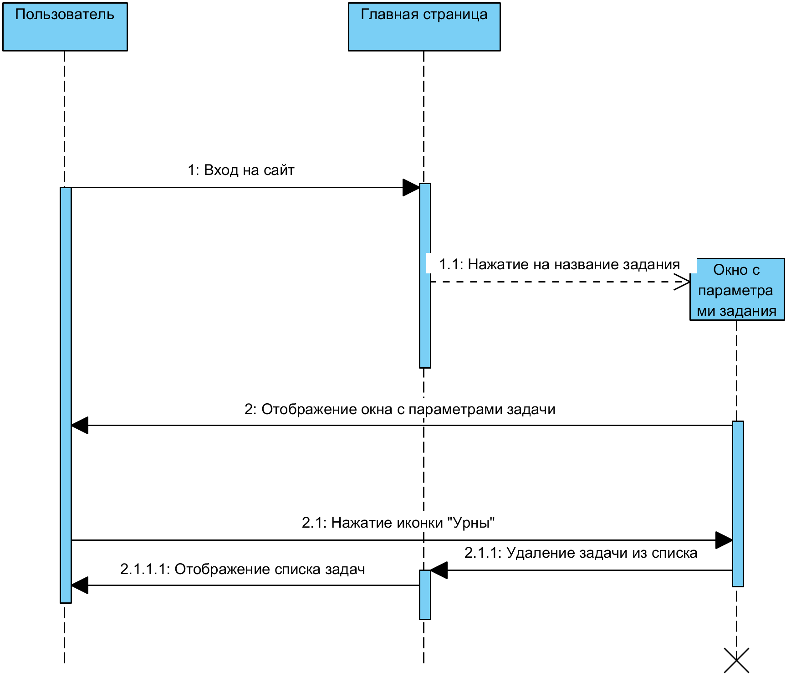

# Диаграммы последовательности
---

# Содержание
1. [Регистрация](#1)
2. [Авторизация](#2)
3. [Добавление задачи](#3)
4. [Редактирование задачи](#4)
5. [Удаление задачи](#5)

### 1. Регистрация

### 2. Авторизация 

### 3. Добавление задачи

### 4. Редактирование задачи 

### 5. Удаление задачи

