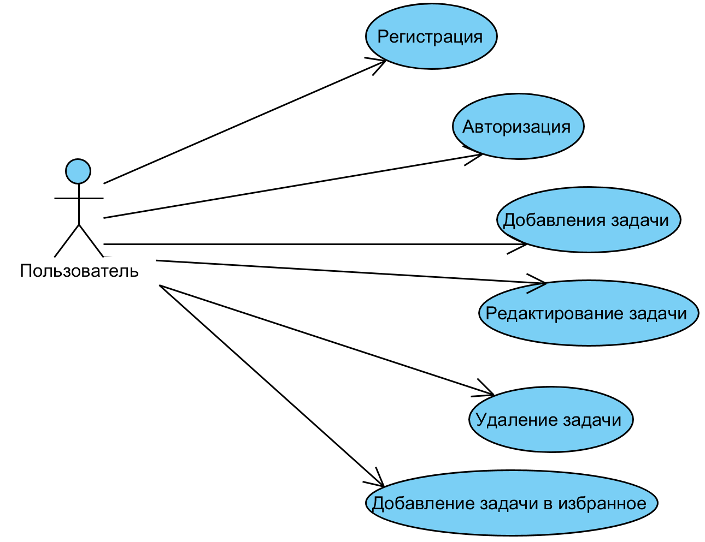

# Поток событий
---

# Содержание
1 [Актёры](#1)  
2 [Варианты использования](#2)  
2.1 [Регистрация](#2.1)  
2.2 [Авторизация](#2.2)  
2.3 [Добавление задачи](#2.3)  
2.4 [Редактирование задачи](#2.4)  
2.5 [Удаление задачи](#2.5)  
2.6 [Добавление задачи в Избранное](#2.6)  
<a name="1"/>

# 1 Актёры

| Актёр | Описание |
|:--|:--|
| Пользователь сайта | Человек, пользователь сайта |

<a name="2"/>

# 2 Варианты использования

<a name="2.1"/>

## 2.1 Регистрация

**Описание.** Вариант использования "Регистрация" позволяет пользователю пройти регистрацию на сайте.  

**Основной поток.**
1. Вариант использования начинается, когда пользователь заходит на сайт впервые;
2. Сайт выводит выводит 2 строки для ввода почты и пароля и кнопки Sign Up;
3. Пользователь вводит почту и пароль. После нажатии кнопки Sign Up.
4. Если почта существует, то пользователя перекидывает на окно авторизации. Если нет, то возвращаемся к шагу 3.
5. Вариант использования завершается;

<a name="2.2"/>

## 2.2 Авторизация

**Описание.** Вариант использования "Авторизация" позволяет пользователю пройти авторизацию на сайте.  

**Основной поток.**
1. Вариант использования начинается, когда пользователь заходит на сайт;
2. Сайт выводит выводит 2 строки для ввода почты и пароля и кнопки Sign In;
3. Пользователь вводит почту и пароль. После нажатии кнопки Sign In.
4. Если почта и пароль верные, то пользователя перекидывает на главную страницу. Если нет, то возвращаемся к шагу 3.
5. Вариант использования завершается;

<a name="2.3"/>

## 2.3 Добавление задачи

**Описание.** Вариант использования "Добавление задачи" позволяет пользователю добавить новую задачу.

**Основной поток.**
1. Пользователь нажимает на строку Add Task;
2. Пользователь вводит название задачи;
3. Приложение нажимает клавишу Enter;
4. Вариант использования завершается;

<a name="2.4"/>

## 2.4 Редактирование задачи

**Описание.** Вариант использования "Редактирование задачи" позволяет пользователю редактировать параметры задачи(название, дату, описание и категорию).  

**Основной поток.**
1. Пользователь нажимает на название задачи;
2. Пользователь изменяет параметры задачи;
3. Пользователь нажимает на иконку "Сохранить";
4. Вариант использования завершается;

<a name="2.5"/>

## 2.5 Удаление задачи

**Описание.** Вариант использования "Удаление задачи" позволяет удалить задачу.  

**Основной поток.**
1. Пользователь нажимает на название задачи;
2. Пользователь в окне параметров задачи нажимает значок "Урна";
3. Вариант использования завершается;

<a name="2.6"/>

## 2.6 Добавление задачи в Избранное

**Описание.** Вариант использования "Добавление задачи в Избранное" позволяет добавить задачу в катол "Избранное".  

**Основной поток.**
1. Пользователь нажимает на иконку "Звезды" справа от названия задачи;
2. Вариант использования завершается;
