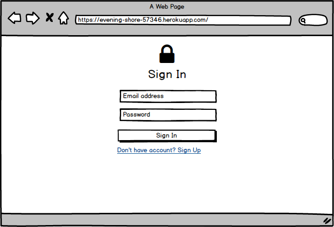
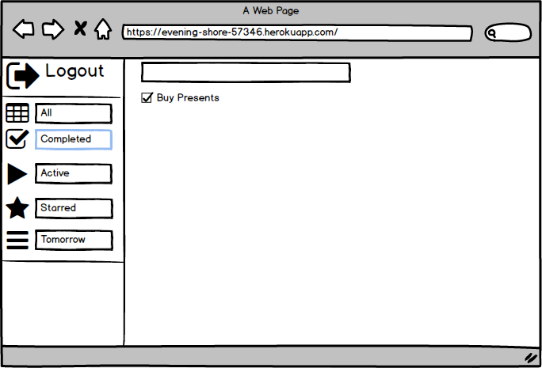

# Mockups
---

# Содержание
1. [Окно Регистрации](#1)
2. [Окно Авторизации](#2)
3. [Главная страница](#3)
4. [Добавление задачи](#4)
5. [Редактирование задачи](#5)
6. [Выполненные задачи](#6)
7. [Закладки](#7)

### 1. Регистрация 

### 2. Авторизация 

### 3. Главная страница 

### 4. Добавление задачи 

### 5. Редактирование задачи 

### 6. Выполненные задачи 

### 7. Закладки 

