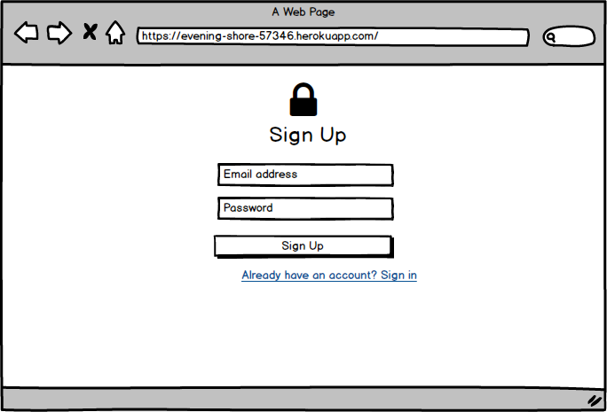
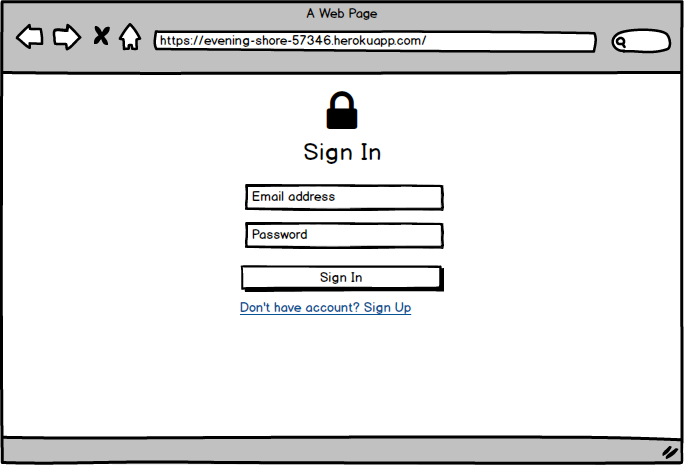
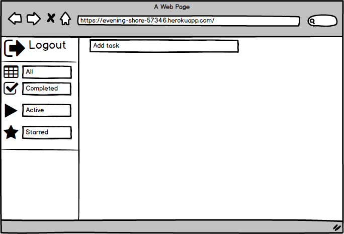
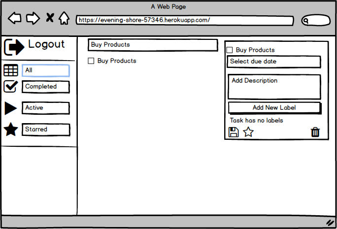
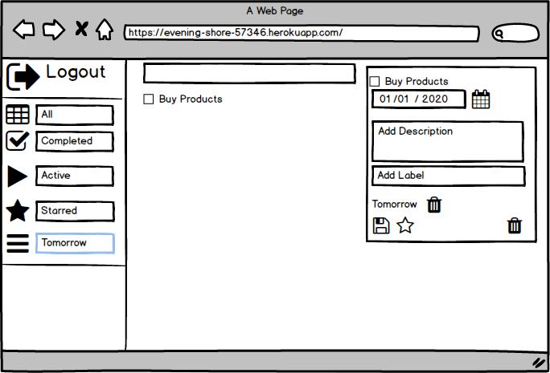
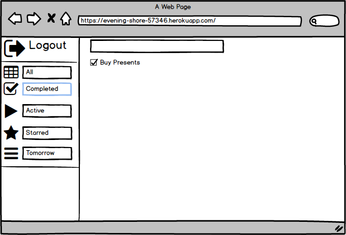
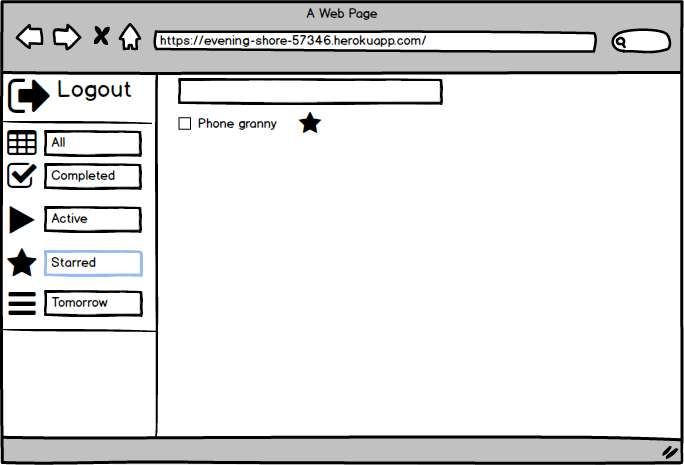

# Требования к проекту
---
# Содержание
1. [Введение](#intro)  
 	1.1 [Назначение](#appointment)  
  	1.2   [Бизнес-требования](#business_requirements)  
  	1.2.1 [Исходные данные](#initial_data)  
  	1.2.2 [Возможности бизнеса](#business_opportunities)  
  	1.2.3 [Границы проекта](#project_boundary)  
  	1.3   [Аналоги](#analogues)  

  2. [Требования пользователя](#user_requirements)  
  	2.1 [Программные интерфейсы](#software_interfaces)  
  	2.2 [Интерфейс пользователя](#user_interface)  
  	2.3 [Характеристики пользователей](#user_specifications)  
  	2.3.1 [Классы пользователей](#user_classes)  
  	2.3.2 [Аудитория приложения](#application_audience)  
  	2.3.2.1 [Целевая аудитория](#target_audience)  
  	2.3.2.1 [Побочная аудитория](#collateral_audience)  
  	2.4 [Предположения и зависимости](#assumptions_and_dependencies)

  3. [Системные требования](#system_requirements)  
  	3.1 [Функциональные требования](#functional_requirements)  
  	3.1.1 [Основные функции](#main_functions)    
  	3.1.2 [Ограничения и исключения](#restrictions_and_exclusions)  
  	3.2 [Нефункциональные требования](#non-functional_requirements)  
  	3.2.1 [Атрибуты качества](#quality_attributes)  
  	3.2.1.1 [Требования к удобству использования](#requirements_for_ease_of_use)  
  	3.2.1.2 [Требования к безопасности](#security_requirements)  
  	3.2.1.3 [Требования к производительности](#performance_requirements)  
  	3.2.2 [Внешние интерфейсы](#external_interfaces)  
  	3.2.3 [Ограничения](#restrictions)  

<a name="intro"/>

# 1 Введение

<a name="appointment"/>

## 1.1 Назначение
Сайт Todoer предназначен для создания,редактирования и сортировка заданий, который нужно выполнить.

<a name="business_requirements"/>

## 1.2 Бизнес-требования

<a name="initial_data"/>

### 1.2.1 Исходные данные
Данный сайт является незаменимым помощником, который будет мотивировать и напоминать о незавершенных задачах.

<a name="business_opportunities"/>

### 1.2.2 Возможности бизнеса
Данный сайт будет пользоваться популярностью у современного человека.

<a name="project_boundary"/>

### 1.2.3 Границы проекта
Сайт позволяет создавать, редактировать задачи, создавать свои категории задач, добавлять задачи в избранное.

<a name="analogues"/>

## 1.3 Аналоги
Pomodoro
Todoist
Pompdone
Weekdone

<a name="user_requirements"/>

# 2 Требования пользователя

<a name="software_interfaces"/>

## 2.1 Программные интерфейсы
Сайт использует java-script библиотеку - React

<a name="user_interface"/>

## 2.2 Интерфейс пользователя

# Регистрация

# Авторизация

# Главная страница

# Добавление задачи

# Редактирование задачи

# Выполненные задачи

# Закладки

<a name="user_specifications"/>

## 2.3 Характеристики пользователей

<a name="user_classes"/>

### 2.3.1 Классы пользователей

1. Незарегистрированные пользователи, не имеющие доступ к функционалу.
2. Пользователи, прошедшие регистрацию имеют доступ к полному функционалу.

<a name="application_audience"/>

### 2.3.2 Аудитория приложения

<a name="target_audience"/>

#### 2.3.2.1 Целевая аудитория

Люди всех возрастных категорий.

<a name="collateral_audience"/>

#### 2.3.2.2 Побочная аудитория

Люди младшей и старшей возрастных категорий, обладающие минимальной технической грамотностью.

<a name="assumptions_and_dependencies"/>

## 2.4 Предположения и зависимости
1. Не будет работать в устаревших браузерах, IE версии ниже 11 версии и браузерах в которых отсутствует поддежка JS.

<a name="system_requirements"/>

# 3 Системные требования

<a name="functional_requirements"/>
 1.

## 3.1 Функциональные требования

<a name="main_functions"/>

### 3.1.1 Основные функции

<a name="user_login_to_the_application"/>

#### 3.1.1.1 Вход пользователя в приложение

  | Функция | Требования |
  | :----|:---|
  |  |  |
  |  |  |
  | |
  |  |  |

<a name="restrictions_and_exclusions"/>

### 3.1.2 Ограничения и исключения
1.

<a name="non-functional_requirements"/>

## 3.2 Нефункциональные требования

<a name="quality_attributes"/>

### 3.2.1 Атрибуты качества

<a name="requirements_for_ease_of_use"/>

#### 3.2.1.1 Требования к удобству использования
1.

<a name="security_requirements"/>

#### 3.2.1.2 Требования к безопасности

<a name="performance_requirements"/>

#### 3.2.1.3 Требования к производительности

<a name="external_interfaces"/>

### 3.2.2 Внешние интерфейсы

<a name="restrictions"/>

### 3.2.3 Ограничения
1.
